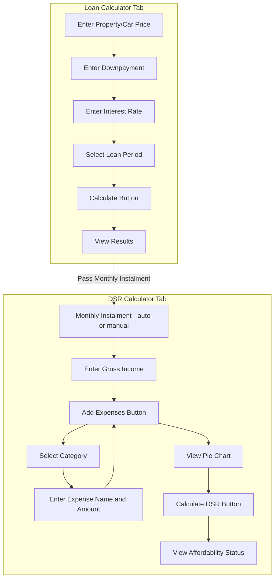

# Loan Calculator & DSR App - Architecture Plan

## Overview

A full-stack web application with:
- **Frontend**: SvelteKit for loan calculation and Debt Service Ratio (DSR) assessment
- **Backend**: FastAPI Python backend for calculations
- **Deployment**: Vercel (monorepo setup)

---

## Project Structure (Monorepo)

```
loan-calc/
├── frontend/                    # SvelteKit application
│   ├── src/
│   │   ├── lib/
│   │   │   ├── components/
│   │   │   │   ├── LoanCalculator.svelte      # Loan calculation form
│   │   │   │   ├── DSRCalculator.svelte       # DSR calculation form
│   │   │   │   ├── ExpenseList.svelte         # Dynamic expense list
│   │   │   │   ├── ExpenseItem.svelte         # Single expense entry
│   │   │   │   ├── PieChart.svelte            # Expense breakdown chart
│   │   │   │   ├── ResultsDisplay.svelte      # Shared results component
│   │   │   │   └── TabNavigation.svelte       # Tab switcher
│   │   │   ├── services/
│   │   │   │   └── api.ts                     # API calls to backend
│   │   │   ├── stores/
│   │   │   │   └── calculator.ts              # Svelte stores for state
│   │   │   └── utils/
│   │   │       └── categories.ts              # Expense categories config
│   │   ├── routes/
│   │   │   ├── +page.svelte                   # Main page with tabs
│   │   │   └── +layout.svelte                 # Layout wrapper
│   │   └── app.html
│   ├── static/                                # Static assets
│   ├── package.json
│   ├── svelte.config.js
│   ├── tailwind.config.js                     # Tailwind configuration
│   ├── postcss.config.js                      # PostCSS for Tailwind
│   ├── vite.config.ts
│   └── tsconfig.json
│
├── backend/                     # FastAPI application
│   ├── main.py                   # FastAPI app with endpoints
│   ├── requirements.txt
│   └── vercel.json              # Vercel config for Python
│
├── vercel.json                   # Root Vercel config (monorepo)
└── README.md
```

---

## Architecture Diagram

```mermaid
flowchart TB
    subgraph Vercel[Vercel Deployment]
        subgraph Frontend[SvelteKit Frontend]
            UI[UI Layer]
            Tabs[Tab Navigation]
            LoanCalc[Loan Calculator]
            DSRCalc[DSR Calculator]
        end
        
        subgraph Backend[FastAPI Backend]
            API[API Endpoints]
            LoanEndpoint[/calculate endpoint]
            DSREndpoint[/dsr endpoint]
        end
    end
    
    User[User] --> UI
    UI --> Tabs
    Tabs --> LoanCalc
    Tabs --> DSRCalc
    LoanCalc -->|POST /calculate| LoanEndpoint
    DSRCalc -->|POST /dsr| DSREndpoint
    LoanCalc -->|Monthly Installment| DSRCalc
```

---

## Component Design

### 1. Loan Calculator Component

**Inputs:**
| Field | Type | Description |
|-------|------|-------------|
| Total Amount | number | Total price of item - house/car |
| Downpayment | number | Initial payment amount |
| Interest Rate | number | Annual interest rate in percent |
| Loan Period | number | Loan duration in years |
| Monthly Budget | number | Users target monthly payment - optional |

**Outputs:**
| Field | Type | Description |
|-------|------|-------------|
| Downpayment | number | Downpayment amount |
| Downpayment % | number | Percentage of total |
| Interest Rate | string | Formatted rate |
| Loan Amount | number | Total minus downpayment |
| Loan Period | string | Formatted duration |
| Monthly Instalment | number | Monthly payment amount |
| Budget Comparison | object | Budget analysis if budget provided |

**Budget Comparison Output:**
| Field | Type | Description |
|-------|------|-------------|
| Budget | number | Users target monthly payment |
| Monthly Payment | number | Calculated monthly instalment |
| Difference | number | Budget minus monthly payment |
| Status | string | Within Budget / Over Budget |
| Suggestions | list | Recommendations to fit budget |

**Budget Suggestions Logic:**
```
If Over Budget:
1. Calculate required downpayment to meet budget
2. Calculate required loan term extension to meet budget
3. Calculate required interest rate reduction to meet budget
4. Suggest combinations of adjustments

Example Suggestions:
- "Increase downpayment by RM X to meet your budget"
- "Extend loan term to X years to meet your budget"
- "A combination: Increase downpayment by RM X AND extend term to Y years"
```

### 2. DSR Calculator Component

**Inputs:**
| Field | Type | Description |
|-------|------|-------------|
| Monthly Instalment | number | Auto-filled from loan calc or manual |
| Gross Monthly Income | number | Total income before deductions |
| Net Monthly Income | number | Income after deductions - optional |
| Debt/Expense Items | list | Dynamic list of debts and expenses |

**Debt/Expense Categories:**
| Category | Examples |
|----------|----------|
| Housing | Rent, mortgage, maintenance fees |
| Transportation | Car loan, fuel, parking, tolls |
| Utilities | Electricity, water, internet, phone |
| Insurance | Life, health, car, property |
| Credit Cards | Outstanding balances, minimum payments |
| Personal Loans | Education, personal financing |
| Others | Subscriptions, entertainment, etc. |

**Expense Entry UI:**
- Add expense button to dynamically add items
- Dropdown for category selection
- Input field for expense name and amount
- Delete button for each item
- Real-time total calculation

**Outputs:**
| Field | Type | Description |
|-------|------|-------------|
| Total Monthly Debt | number | Sum of all debt payments |
| DSR Percentage | number | Debt/Income ratio |
| Status | string | Healthy/Medium/Caution/High Risk |
| Recommendation | string | Affordability assessment |
| Pie Chart | visualization | Breakdown of expenses by category |

**DSR Calculation Formula:**
```
DSR = (Monthly Instalment + Other Debts) / Gross Monthly Income × 100

Status Thresholds:
- Healthy: DSR ≤ 30%
- Medium: 30% < DSR ≤ 50%
- Caution: 50% < DSR ≤ 70%
- High Risk: DSR > 70%
```

---

## API Endpoints

### POST /calculate (Existing - Enhanced)
Request:
```json
{
  "total_amount": 500000,
  "downpayment": 100000,
  "interest": 3.5,
  "years": 30,
  "monthly_budget": 1500
}
```

Response:
```json
{
  "downpayment": 100000.00,
  "downpayment_percentage": 20.0,
  "interest_rate": "3.5 %",
  "loan_amount": 400000.00,
  "loan_period": "30 years",
  "monthly_instalment": 1944.44,
  "budget_comparison": {
    "budget": 1500,
    "monthly_payment": 1944.44,
    "difference": -444.44,
    "status": "Over Budget",
    "suggestions": [
      {
        "type": "extend_term",
        "message": "Extend loan term to 35 years to meet your budget",
        "new_term": 35,
        "new_monthly_payment": 1485.71
      },
      {
        "type": "increase_downpayment",
        "message": "Increase downpayment by RM 91,200 to meet your budget",
        "additional_downpayment": 91200,
        "new_downpayment": 191200,
        "new_monthly_payment": 1500.00
      },
      {
        "type": "reduce_price",
        "message": "Consider a property priced at RM 408,800 to meet your budget",
        "suggested_price": 408800,
        "new_monthly_payment": 1500.00
      }
    ]
  }
}
```

### POST /dsr (New)
Request:
```json
{
  "monthly_instalment": 1944.44,
  "gross_income": 8000,
  "net_income": 6500,
  "expenses": [
    {"category": "Housing", "name": "Rent", "amount": 1500},
    {"category": "Transportation", "name": "Car Loan", "amount": 800},
    {"category": "Utilities", "name": "Electricity & Water", "amount": 200},
    {"category": "Insurance", "name": "Life Insurance", "amount": 300},
    {"category": "Credit Cards", "name": "Card Payment", "amount": 500}
  ]
}
```

Response:
```json
{
  "total_monthly_debt": 5244.44,
  "dsr_percentage": 65.56,
  "status": "Caution",
  "recommendation": "Your DSR is high. Consider reducing expenses or increasing downpayment.",
  "expense_breakdown": {
    "Housing": 1500,
    "Transportation": 800,
    "Utilities": 200,
    "Insurance": 300,
    "Credit Cards": 500,
    "Loan Instalment": 1944.44
  }
}
```

---

## Vercel Deployment Configuration

### Root vercel.json
```json
{
  "version": 2,
  "builds": [
    {
      "src": "frontend/package.json",
      "use": "@vercel/sveltekit"
    },
    {
      "src": "backend/main.py",
      "use": "@vercel/python"
    }
  ],
  "routes": [
    {
      "src": "/api/(.*)",
      "dest": "backend/main.py"
    },
    {
      "src": "/(.*)",
      "dest": "frontend/$1"
    }
  ]
}
```

### Backend vercel.json
```json
{
  "runtime": "python3.11",
  "handler": "main.app"
}
```

---

## UI Flow Diagram



## DSR Calculator UI Layout

```
┌─────────────────────────────────────────────────────────────┐
│  DSR Calculator                                              │
├─────────────────────────────────────────────────────────────┤
│                                                              │
│  Monthly Instalment: [RM 1,944.44]  (from loan calc)        │
│  Gross Monthly Income: [RM 8,000    ]                       │
│  Net Monthly Income:   [RM 6,500    ] (optional)            │
│                                                              │
├─────────────────────────────────────────────────────────────┤
│  Monthly Expenses                          [+ Add Expense]  │
│                                                              │
│  ┌─────────────────────────────────────────────────────┐    │
│  │ Category: [Housing ▼]  Name: [Rent    ]  RM [1500]  │ ✕  │
│  │ Category: [Transport ▼] Name: [Car Loan]  RM [800]  │ ✕  │
│  │ Category: [Utilities ▼] Name: [Electric]  RM [200]  │ ✕  │
│  └─────────────────────────────────────────────────────┘    │
│                                                              │
│  Total Expenses: RM 2,500                                    │
│                                                              │
├─────────────────────────────────────────────────────────────┤
│                                                              │
│  ┌──────────────────┐    ┌──────────────────────────────┐   │
│  │                  │    │  DSR Result                  │   │
│  │    PIE CHART     │    │  ─────────────               │   │
│  │                  │    │  Total Debt: RM 4,444.44     │   │
│  │  [Expense        │    │  DSR: 55.56%                 │   │
│  │   Breakdown]     │    │  Status: CAUTION             │   │
│  │                  │    │  Recommendation text...      │   │
│  └──────────────────┘    └──────────────────────────────┘   │
│                                                              │
│                    [Calculate DSR]                           │
│                                                              │
└─────────────────────────────────────────────────────────────┘
```

## Loan Calculator UI Layout

```
┌─────────────────────────────────────────────────────────────┐
│  Loan Calculator                                             │
├─────────────────────────────────────────────────────────────┤
│                                                              │
│  Property/Car Price:    [RM 500,000    ]                    │
│  Downpayment:           [RM 100,000    ]                    │
│  Interest Rate (%):     [3.5           ]                    │
│  Loan Period (years):   [30            ]                    │
│                                                              │
│  ─────────────────────────────────────────────────────────  │
│  Monthly Budget (optional): [RM 1,500    ]                  │
│  ─────────────────────────────────────────────────────────  │
│                                                              │
│                    [Calculate]                               │
│                                                              │
├─────────────────────────────────────────────────────────────┤
│  RESULTS                                                     │
│  ─────────────────────────────────────────────────────────  │
│  Loan Amount:           RM 400,000.00                        │
│  Downpayment:           RM 100,000.00 (20%)                  │
│  Interest Rate:         3.5%                                 │
│  Loan Period:           30 years                             │
│  Monthly Instalment:    RM 1,944.44                          │
│                                                              │
│  ┌─────────────────────────────────────────────────────┐    │
│  │  BUDGET COMPARISON                                  │    │
│  │  ─────────────────────────────────────────────────  │    │
│  │  Your Budget:      RM 1,500.00                      │    │
│  │  Monthly Payment:  RM 1,944.44                      │    │
│  │  Difference:       RM -444.44  ⚠️ OVER BUDGET       │    │
│  │                                                     │    │
│  │  SUGGESTIONS:                                       │    │
│  │  • Extend loan term to 35 years → RM 1,485.71/mo   │    │
│  │  • Increase downpayment by RM 91,200 → RM 1,500/mo │    │
│  │  • Consider property at RM 408,800 → RM 1,500/mo   │    │
│  └─────────────────────────────────────────────────────┘    │
│                                                              │
│  [Use this instalment in DSR Calculator →]                  │
│                                                              │
└─────────────────────────────────────────────────────────────┘
```

---

## Implementation Steps

### Phase 1: Project Setup
1. Create monorepo folder structure
2. Initialize SvelteKit project in frontend/
3. Move existing Python files to backend/
4. Configure Vercel deployment files

### Phase 2: Backend Development
1. Update FastAPI with CORS for frontend
2. Add /dsr endpoint
3. Add input validation with Pydantic models
4. Test endpoints locally

### Phase 3: Frontend Development
1. Create base layout and styling
2. Implement TabNavigation component
3. Build LoanCalculator component
4. Build DSRCalculator component
5. Create API service layer
6. Add form validation
7. Implement responsive design

### Phase 4: Integration & Deployment
1. Connect frontend to backend API
2. Test full flow locally
3. Deploy to Vercel
4. Configure environment variables
5. Test production deployment

---

## Tech Stack Summary

| Layer | Technology |
|-------|------------|
| Frontend Framework | SvelteKit |
| Frontend Language | TypeScript |
| Styling | TailwindCSS |
| Charting | Chart.js or svelte-chartjs |
| Backend Framework | FastAPI |
| Backend Language | Python 3.9+ |
| Deployment | Vercel |
| API Style | REST |

---

## Notes

- The monthly instalment from Loan Calculator can be passed to DSR Calculator
- DSR thresholds: Healthy ≤30%, Medium 30-50%, Caution 50-70%, High Risk >70%
- Consider adding a reset button for both calculators
- Mobile-first responsive design recommended
